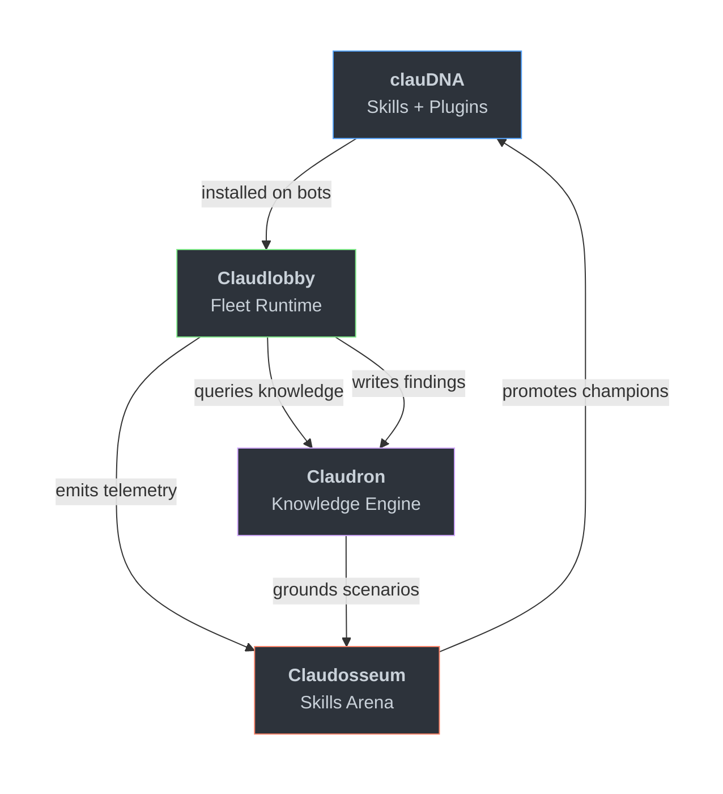

# Claudfather

**The place where Claude Code agents are raised, equipped, and continuously improved.**

An open-source ecosystem for building production agent fleets. Run distinct, cooperating bots on cheap hardware — each with its own identity, knowledge, and skills. No hosted dependencies required.

---

## The Ecosystem



Three closed loops drive continuous improvement:

| Loop | How it works |
|------|-------------|
| **Promotion** | Skills enter Claudosseum, battle with real-world telemetry scoring, champions ship in the next clauDNA release |
| **Knowledge** | Bots write findings to Claudron during operation. Future bots query before acting. Recurring patterns become skill candidates |
| **Grounding** | Claudosseum draws battle scenarios from Claudron content — skills are evaluated against problems bots actually encountered |

---

## Repositories

| | Repo | What it does | Status |
|---|------|-------------|--------|
| :green_circle: | [**Claudlobby**](https://github.com/Claudfather/Claudlobby) | Fleet compositor. `fleet.yaml` + shared library → runnable bot directories with isolated identities, MCP servers, and systemd/launchd supervision. | Active |
| :green_circle: | [**clauDNA**](https://github.com/Claudfather/clauDNA) | Canonical skills, hooks, and agents for Claude Code. The shared genome bots inherit. Distributed as a marketplace plugin. | Active |
| :yellow_circle: | [**Claudosseum**](https://github.com/Claudfather/Claudosseum) | Promotion engine. Arena where skills are evaluated against real scenarios. Champions earn their place in clauDNA. | Design |
| :yellow_circle: | [**Claudron**](https://github.com/Claudfather/Claudron) | Standalone knowledge engine. Init a vault, store structured knowledge, retrieve it across sessions and projects. The fleet's portable memory. | Design |

---

## Quick Start

### "I want to run an agent fleet"

Start with [**Claudlobby**](https://github.com/Claudfather/Claudlobby). Clone, write a `fleet.yaml`, generate, run.

```bash
git clone https://github.com/Claudfather/Claudlobby.git
cd Claudlobby
cp fleet.yaml.example local/my-fleet/fleet.yaml
# Edit fleet.yaml — define your bots
claudlobby --fleet my-fleet generate
lib/spin-up-bot.sh local/my-fleet/runtime/bots/my-bot
```

Each bot gets its own Telegram channel, persona, and isolated state.

### "I want skills for my Claude Code"

Start with [**clauDNA**](https://github.com/Claudfather/clauDNA). Install as a plugin — one command.

```bash
claude plugins install Claudfather/clauDNA
```

You now have access to the canonical skill set: code review, commit workflows, deployment, knowledge management, and more. Works standalone — no fleet required.

### "I want structured knowledge across sessions"

Start with [**Claudron**](https://github.com/Claudfather/Claudron). A standalone knowledge engine: init a vault, store structured markdown knowledge, retrieve it across sessions and projects.

Claudron is in design — the CLI is not yet released. Follow the repo for updates.

When it ships, Claudron becomes the portable cartridge for your fleet — clone your vault on any machine, plug it in, your fleet's memory travels with it.

### "I want to evaluate and evolve skills"

Start with [**Claudosseum**](https://github.com/Claudfather/Claudosseum). Submit skills, run battles, promote winners.

---

## Philosophy

**Fleet-first.** Most agent tooling assumes one bot, one task, one session. Claudfather assumes a squad: distinct identities coordinating on shared work, each with their own expertise. The architecture supports one bot cleanly but shines at five.

**Composable, not monolithic.** Each repo is independently useful. clauDNA works without Claudlobby. Claudron works without a fleet. Claudosseum evaluates skills from any source. Adopt one piece or the full stack — no lock-in between layers.

**Personality-rich.** Bots are entities, not threads. Each gets a voice, expertise domains, guardrails, and communication style. A code reviewer and a designer on the same fleet behave differently because they are different. The system never collapses them into a generic "AI assistant."

**Local-first.** A fleet runs on a Pi in a closet. No cloud dependencies for basic operation. Git-backed knowledge. File-based configuration. Plain markdown docs. Everything version-controlled, everything inspectable, everything yours.

**High-bar canonical.** Skills that ship in clauDNA earned their place through arena evaluation against real-world scenarios. The canonical set is trusted precisely because promotion is hard.

---

## Architecture at a Glance

```
You (human)
 │
 ├── claude plugins install clauDNA     ← skills for any Claude Code session
 │
 ├── claudron init ~/vault              ← structured knowledge, any project
 │
 └── claudlobby generate                ← full fleet: bots + skills + knowledge
      │
      ├── Bot: manager (orchestrates via tmux)
      ├── Bot: engineer (writes code, opens PRs)
      ├── Bot: designer (visual QA, screenshots)
      └── Bot: reviewer (code review, standards)
           │
           ├── Each bot installs clauDNA (skills)
           ├── Each bot queries Claudron (knowledge)
           └── Each bot emits signal to Claudosseum (optional)
```

---

## Contributing

Each repo has its own contribution guidelines. Start with the repo closest to your interest:

- **Skills and plugins** → [clauDNA](https://github.com/Claudfather/clauDNA)
- **Fleet tooling and lifecycle scripts** → [Claudlobby](https://github.com/Claudfather/Claudlobby)
- **Knowledge engine and vault spec** → [Claudron](https://github.com/Claudfather/Claudron)
- **Arena mechanics and evaluation** → [Claudosseum](https://github.com/Claudfather/Claudosseum)

See [PROJECT_MISSION.md](https://github.com/Claudfather/.github/blob/main/PROJECT_MISSION.md) for the full vision, design decisions, and open questions.

---

<sub>Local-first. Open source. No hosted dependencies required.</sub>
